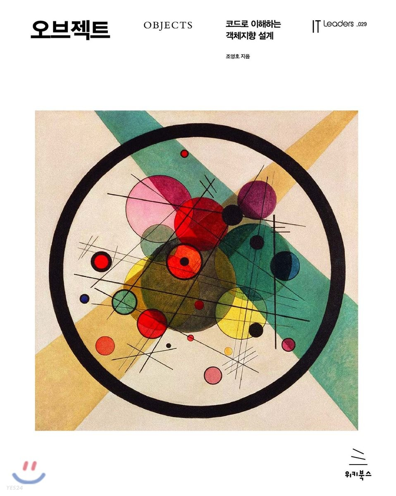

# 북스터디 - 오브젝트

> 2023.02.19부터 2023.??.??.까지 ?주 간 진행되는 스터디입니다.  
> 조영호의 `오브젝트`를 읽고 배운점을 남기고 피드백합니다.  

 

# 📒 진행 방식

- **매주 월요일 오후 8시** 스터디 진행한다.
- **일요일 오후 10시**까지 '발표가 가능할 수준'까지 학습하며 학습 자료 PR 남긴다.
- 스터디 당일, 모든 팀원이 돌아가며 학습 내용 발표한다.
  - 이해가 잘 되지 않는 부분이나 질문이 있다면 함께 피드백
  - 발표 및 피드백이 끝난 팀원의 PR은 merge
- 발표가 모두 종료되었다면 다음 스터디에서의 학습할 양과 담당자 정하고 스터디를 마친다.
   

# 🚩 스터디 참여 체크

스터디 참여는 2가지가 체크됩니다.

1. 학습자료를 마감시간 전까지 작성했는가?
2. 스터디 당일에 참석하고 발표를 진행했는가?
    

# 📅 일정

| 일정 |       날짜       | 범위 | 완료여부 |
| :---: | :-------------: | :-: | :-: |
| 1주차 | 02.19 (일) 09:30 | 1장 | ✅ |
<!--
| 2주차 | 02.27 (월) 20:00 | 2장 |  |
| 3주차 | 03.06 (월) 20:00 | 3장 |  |
| 4주차 | 03.13 (월) 20:00 | 4장 |  |
| 5주차 | 03.20 (월) 20:00 | 5장 |  |
| 6주차 | 03.27 (월) 20:00 | 6장 |  |
| 7주차 | 04.03 (월) 20:00 | 7장 |  |
| 8주차 | 04.10 (월) 20:00 | 8장 |  |
| 9주차 | 04.17 (월) 20:00 | ❌ |  |
| 10주차 | 04.24 (월) 20:00 | ❌ |  |
| 11주차 | 05.01 (월) 20:00 | 9장 |  |
| 12주차 | 05.08 (월) 20:00 | 10장 |  |
| 13주차 | 05.15 (월) 20:00 | 11장 |  |
| 14주차 | 05.22 (월) 20:00 | 12장 |  |
| 15주차 | 05.29 (월) 20:00 | 13장 |  |
| 16주차 | 06.05 (월) 20:00 | ❌ |  |
| 17주차 | 06.12 (월) 20:00 | ❌ |  |
-->
# ⚙ 규칙

모든 작업은 Pull-Request 를 적극 활용하여 Review 와 커밋 기록을 남기는 것을 권장합니다.

### Directory Structure

- `/챕터/챕터번호_영문이름` 형식으로 업로드 해주세요.
  - ex) `Chapter01/01_jongheon.md`

### Branch

- `이름` 형식으로 각자 브랜치에 작업해주세요.
  - ex) `jongheon`

### Commit Convention

- 커밋메시지는 아래와 같은 형식으로 작성
  - 한 주의 markdown문서를 시작할 때  
    :page_facing_up: Docs. {설명}
  - 새로운 내용 추가   
    :pencil2: Add. {설명}
  - 기존 내용을 업데이트한 경우   
    :bulb: Upt. {설명}
  - 오타 혹은 문장을 수정한 경우    
    :hammer: Fix. {설명}
  - 문서 스타일 및 포맷팅, 네이밍 변경    
    :art: Style. {설명}
  - 삭제한 경우    
    :fire: Del. {설명}
  - 되돌린 경우    
    :rewind: Rev. {설명}
  - 머지한 경우    
    :twisted_rightwards_arrows: Merge. {From브랜치명} into Main, {설명}
  - 개선해야하나 일단 커밋한 경우      
    :poop: Bad. {설명}
- 그외 case는 추후 추가될 수 있습니다.

`gitmoji -c` 커멘드를 이용하여 사용하면, 좀 더 쉽게 사용 가능
 
[gitmoji 공식 홈페이지](https://gitmoji.dev/)
 

# 🙋‍♀ 스터디 멤버

[Jongheon-Kim](https://github.com/Dreaming-J)   Pre Back-end Developer

[Dogyun-Kim](https://github.com/Just-love-myself)   Pre Back-end Developer
 